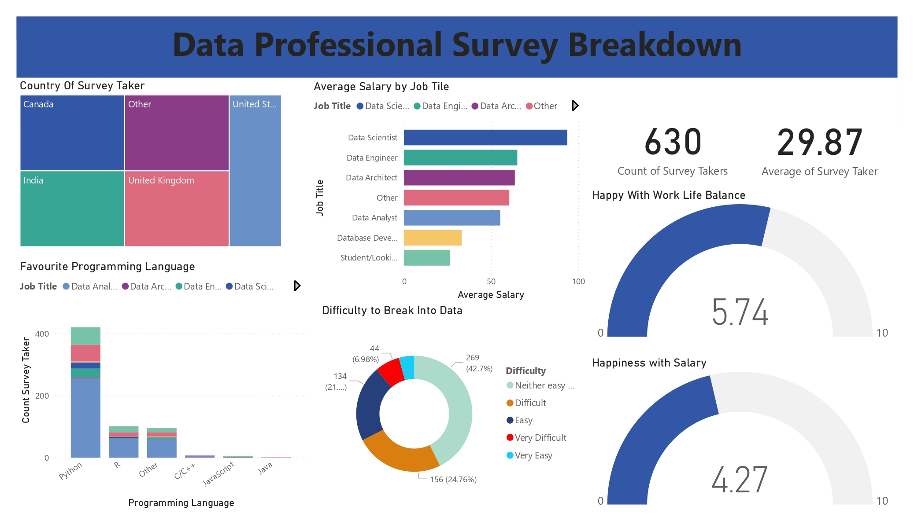

# 📊 Data Professional Survey Breakdown – Power BI Dashboard  

### 🔍 Project Overview  
This Power BI dashboard provides insights into a survey conducted among data professionals. The dataset includes details on job roles, salaries, preferred programming languages, work-life balance, and the difficulty of breaking into the field.  

### 🛠 Tools & Technologies  
- **Power BI** – Data visualization and dashboard creation  
- **Data Modeling** – Structuring relationships between data  
- **Excel/CSV** – Data source preprocessing (if applicable)  

### 📌 Key Insights  
✔️ **Average Salary by Job Title** – Comparison across Data Analysts, Scientists, Engineers, etc.  
✔️ **Favorite Programming Languages** – Python vs. R vs. others  
✔️ **Work-Life Balance & Salary Satisfaction** – Happiness levels in the industry  
✔️ **Breaking into Data Careers** – Perceived difficulty by respondents  

### 📷 Dashboard Preview  
# Data Professional Survey

